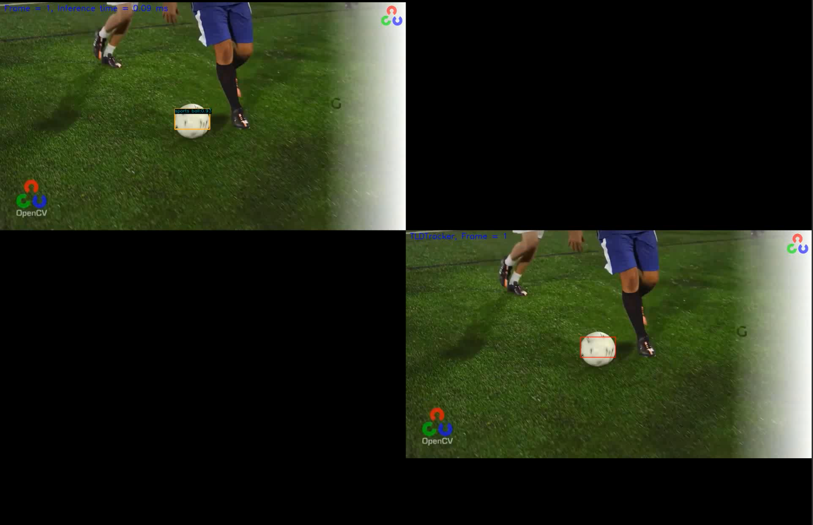

# Detection and tracking with OpenVINO, YOLOv5, and OpenCV  

   


This work relies on the following code bases:   
[Learn OpenCV](https://github.com/spmallick/learnopencv)  
[YOLOv5 Demo](https://github.com/violet17/yolov5_demo)  


## Install
```
pip install opencv-contrib-python
pip install openvino-dev
pip install onnx
```

## Convert model YOLOv5 to OpenVINO format
```
git clone https://github.com/ultralytics/yolov5
cd yolov5
pip install -r requirements.txt
python export.py --include openvino
```

## Run dectection and tracking

```
python ./detect_and_track_vino.py --model model_path --input input_path --output output_path --class_name target_tracking_class
```